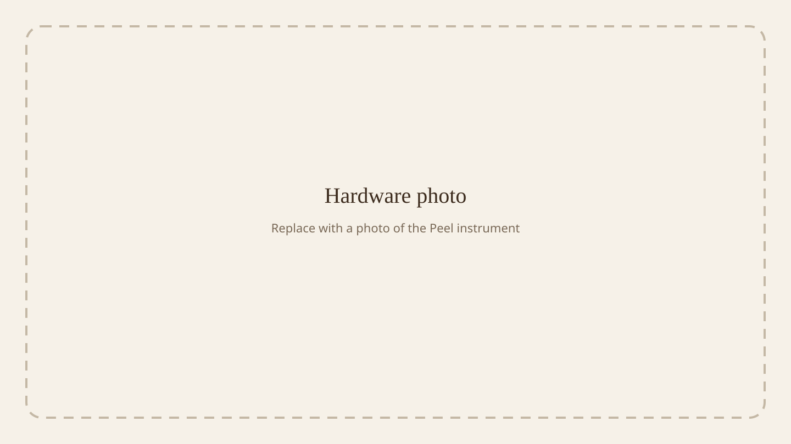
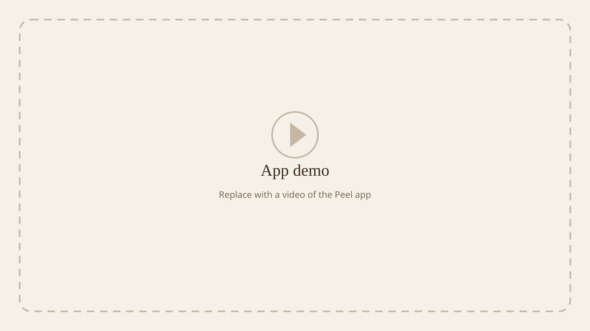
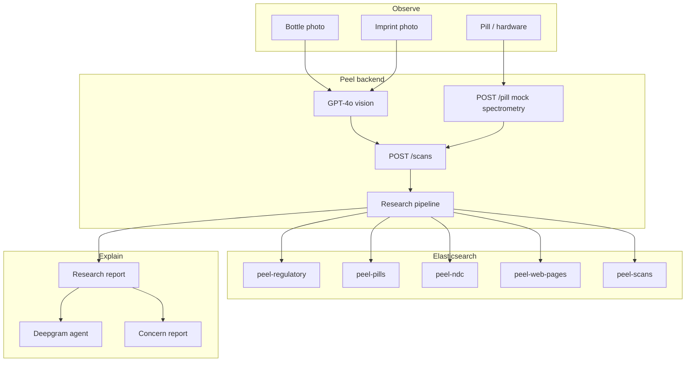

<p align="center">
  
</p>

# Peel

## Check the bottle, the imprint, and the pill — then read the evidence.

Peel is an open-source medicine check for places where a tablet and its packaging may not match. Photograph the **bottle**, read the **imprint**, measure the **pill**, and get a sourced report.

[](https://github.com/viktorinkov/HackMIT-2026/actions/workflows/hardware.yml)
[](https://www.python.org/downloads/)
[](https://fastapi.tiangolo.com)
[](https://flutter.dev)
[](https://www.elastic.co)
[](LICENSE)

<p align="center">
  
  <br>
  <em>Hardware photo — coming soon</em>
</p>

<p align="center">
  
  <br>
  <em>App demo — coming soon</em>
</p>

## Table of contents

- [Why Peel exists](#why-peel-exists)
- [How a check works](#how-a-check-works)
- [What's in this repository](#whats-in-this-repository)
- [Features](#features)
- [Architecture](#architecture)
- [Built with](#built-with)
- [Getting started](#getting-started)
- [Usage](#usage)
- [HTTP API](#http-api)
- [Verification](#verification)
- [Troubleshooting](#troubleshooting)
- [Privacy](#privacy)
- [Project layout](#project-layout)
- [Contributing](#contributing)
- [License](#license)
- [Acknowledgments](#acknowledgments)

## Why Peel exists

People often cannot tell whether the tablet in their hand is the medicine on the label. Counterfeit and substandard medicines are a documented public-health problem, especially where supply chains are long and local regulators are stretched. Packaging can be copied. Imprints can be faked. The contents are the part you cannot see.

Peel keeps three observations separate:

| Observation | Source |
| --- | --- |
| **Bottle** | Text and markings read from a photo of the container |
| **Imprint** | Characters, color, and shape read from a photo of the tablet |
| **Pill** | A hardware reading of the physical tablet |

The backend then searches a seeded regulatory corpus (FDA, WHO, Health Canada, MHRA, NAFDAC, NLM Pillbox, openFDA NDC) plus a budgeted live web pass, and returns a sourced report. Every citation is resolved back to stored evidence.

## How a check works

```
1. Photograph the bottle label
2. Photograph the pill imprint
3. Take a hardware reading of the pill
4. POST /scans  →  research runs in the background
5. Poll GET /scans/{id}  until status is partial or complete
6. Talk to the Deepgram agent, or file a concern report
```

Research is staged so the client can render early:

| Status | When | What you can show |
| --- | --- | --- |
| `pending` | Scan created | Wait |
| `partial` | Deterministic lookups finished (~0.3–3 s) | Lot / NDC / imprint hits |
| `complete` | Agent + structured report finished | Full sourced report |
| `error` | Elasticsearch was unreachable at load | Retry |

Verdicts are `no_adverse_findings`, `mismatch_found`, `recall_match`, or `insufficient_evidence`.

## What's in this repository

Peel is mid-hackathon. This README describes what is actually here, not the full product sketch.

| Piece | Status |
| --- | --- |
| FastAPI research backend | Runnable. Vision, seeding, Elasticsearch retrieval, Agent Builder, scans, reports. |
| Seeded regulatory corpus | FDA enforcement, WHO alerts, Health Canada, MHRA, NAFDAC, Pillbox, openFDA NDC. |
| Photo identification | `POST /photo-identification/bottle` and `/imprint` via GPT-4o. |
| Hardware instrument | XIAO ESP32-S3 + BOX-3 face; streams one JSON line a second over USB. |
| Hardware debug app | Flutter Android app in `hardware/peel_app` (live readout, faults, simulator). |
| Hardware → `/scans` | **Mocked.** `POST /pill` returns `mock-spectrometry`. Real classification is not on `main` yet. |
| Voice agent | `POST /deepgram/session` issues settings from the scan. A consumer client is still catching up. |
| Concern reports | `POST /scans/{id}/reports` stores purchase date, place, and seller. |
| Consumer Flutter app | In progress on a feature branch; not in this tree. |
| Hosted docs site | Not started. Interactive API docs are FastAPI `/docs`. |

Deeper backend notes: [`backend/README.md`](backend/README.md). Hardware flash and simulator: [`hardware/README.md`](hardware/README.md).

## Features

- **Three-source scan** — bottle, imprint, and pill stay distinct through the API, the report, and the voice agent.
- **Vision that refuses to invent** — label and imprint prompts extract only what is in the photo, and drop personal identifiers.
- **Exact lot and NDC matching** — old recalls still surface; lot-string collisions with a different product are downgraded, not treated as a hit.
- **Pill identification ladder** — imprint first, then shape family, then a looser fallback. Shape or color alone never identifies a tablet.
- **Budgeted live web research** — Firecrawl searches are capped per scan and per process, cached by source tier, and indexed back into Elasticsearch.
- **Graceful degradation** — if Agent Builder, Firecrawl, or OpenAI is down, the deterministic report still stands.
- **Voice with a scan context** — Deepgram is handed a string `scan_context`, not a backend URL.
- **Privacy defaults** — Rx numbers, pharmacy names, and directions are dropped unless `SCANS_STORE_SENSITIVE=true`. Image bytes are never stored.

## Architecture



The five-stage pipeline (normalize → deterministic lookup → Firecrawl → Agent Builder → structured coerce) is documented in [`backend/README.md`](backend/README.md#architecture-and-scan-lifecycle).

## Built with

| Layer | Stack |
| --- | --- |
| Backend | Python 3.13, FastAPI, uv, Pydantic Settings |
| Vision and judge | OpenAI GPT-4o |
| Search | Elastic Cloud Serverless, ES\|QL Agent Builder, Jina embeddings |
| Live web | Firecrawl |
| Identity | RxNav, openFDA NDC, NLM Pillbox |
| Voice | Deepgram Voice Agent |
| Hardware | Seeed XIAO ESP32-S3, ESP32-S3-BOX-3, Arduino firmware |
| Hardware app | Flutter, USB serial |
| Deploy | FastAPI on Runpod (`backend/scripts/runpod-start.sh`) |

## Getting started

### Prerequisites

- **Python 3.13** and [uv](https://docs.astral.sh/uv/)
- An [OpenAI](https://platform.openai.com/) API key (vision + report coercion)
- An [Elasticsearch](https://www.elastic.co/elasticsearch) endpoint and API key (Elastic Cloud Serverless is what we run against)
- Optional: [Firecrawl](https://www.firecrawl.dev/) key for live web research
- Optional: [Deepgram](https://deepgram.com/) key for the voice agent
- Optional, hardware only: [Arduino CLI](https://arduino.github.io/arduino-cli/), Flutter 3.47+, an Android phone that can USB-host

### Backend

```bash
git clone https://github.com/viktorinkov/HackMIT-2026.git
cd HackMIT-2026/backend
uv sync
cp .env.example .env   # or keep secrets in a repo-root .env
```

Minimum `.env`:

```bash
OPENAI_API_KEY=sk-...
ELASTICSEARCH_URL=https://....es....elastic.cloud
ELASTICSEARCH_API_KEY=...
FIRECRAWL_API_KEY=     # blank disables live web search
DEEPGRAM_API_KEY=      # blank disables voice session minting
```

The settings loader reads the **repo-root `.env` first, then `backend/.env`** (later wins). Every optional key is documented as a comment in [`backend/.env.example`](backend/.env.example).

```bash
uv run backend          # http://127.0.0.1:8000  — interactive docs at /docs
```

### Seed the corpus (once)

Seeding is anonymous HTTP. It spends **no Firecrawl credits and no LLM tokens**.

```bash
uv run peel-seed --list
uv run peel-seed seed --sources all
```

A full seed is on the order of three minutes once the raw files are cached under `backend/data/` (gitignored). Re-runs are idempotent.

### Hardware (optional)

```bash
# Firmware
arduino-cli compile --upload -p /dev/cu.usbmodemXXXX \
  --fqbn esp32:esp32:XIAO_ESP32S3 hardware/firmware/17_stream

# Debug app
cd hardware/peel_app
flutter build apk --debug
adb install -r build/app/outputs/flutter-apk/app-debug.apk

# No board? Simulate one.
python3 hardware/sim/fake_board.py --tcp 9000
```

Then press **Simulator** in the app and enter `host:port`. See [`hardware/README.md`](hardware/README.md).

## Usage

Interactive API: [http://127.0.0.1:8000/docs](http://127.0.0.1:8000/docs).

### Recalled lot (the money shot)

Accord Healthcare Levothyroxine Sodium 200 mcg, NDC `16729-457-15`, lot `D2402430` → FDA recall `D-0785-2026`.

```bash
curl -s localhost:8000/scans -X POST -H 'content-type: application/json' -d '{
  "device_id": "demo-1",
  "demo": true,
  "country": "United States",
  "bottle": {
    "is_medication_container": true,
    "generic_name": "Levothyroxine Sodium",
    "strength": "200 mcg",
    "form": "tablet",
    "ndc": "16729-457-15",
    "manufacturer": "Accord Healthcare",
    "lot_number": "D2402430",
    "expiration": "10/2026",
    "confidence": 0.93
  },
  "imprint": {"is_pill": true, "color": "pink", "shape": "round", "confidence": 0.7},
  "hardware": {
    "status": "substandard",
    "spectrum": [0.1, 0.1, 0.1, 0.1],
    "degraded": false,
    "pill_type": "levothyroxine",
    "confidence": 0.78
  },
  "hardware_model": "mock-spectrometry"
}'
```

Poll `GET /scans/{scan_id}` until `research.verdict` is `recall_match`. A near-miss with lot `D2402999` on the same NDC must **not** fire `recall_match`.

### LMIC falsified product

HEALMOXY Amoxicillin 500 mg, batch `H02605` → WHO Medical Product Alert N°2/2025 and NAFDAC Public Alert 17/2025.

```bash
curl -s localhost:8000/scans -X POST -H 'content-type: application/json' -d '{
  "device_id": "demo-2",
  "demo": true,
  "country": "Cameroon",
  "bottle": {
    "is_medication_container": true,
    "brand_name": "HEALMOXY",
    "generic_name": "Amoxicillin",
    "strength": "500 mg",
    "form": "capsule",
    "manufacturer": "MAXHEAL PHARMACEUTICALS",
    "lot_number": "H02605",
    "confidence": 0.85
  },
  "imprint": {"is_pill": true, "color": "white", "shape": "capsule", "confidence": 0.6}
}'
```

### Photo identification

```bash
curl -s localhost:8000/photo-identification/bottle \
  -F "photo=@photos-for-testing/bottle.png"

curl -s localhost:8000/photo-identification/imprint \
  -F "photo=@photos-for-testing/pill.jpeg"
```

### Lookups without a scan

```bash
curl -s "localhost:8000/knowledge/lot/D2402430"
curl -s "localhost:8000/knowledge/ndc/16729-457-15"
curl -s "localhost:8000/knowledge/pill?imprint=5892V&shape=capsule"
curl -s "localhost:8000/knowledge/stats"
```

More demo scripts, including a clean/unknown bottle: [`backend/README.md#demo-script`](backend/README.md#demo-script).

## HTTP API

| Method | Path | Purpose |
| --- | --- | --- |
| `POST` | `/photo-identification/bottle` | Read a container photo |
| `POST` | `/photo-identification/imprint` | Read a pill-imprint photo |
| `POST` | `/pill` | Mock hardware result (`real` / `substandard` / `fake` / `unknown`) |
| `POST` | `/scans` | Create a scan; research starts in the background (`202`) |
| `GET` | `/scans/{id}` | Full envelope; poll until `complete` or `error` |
| `GET` | `/scans/{id}/context` | Voice-agent handoff. `?as_string=true` for a string dynamic variable |
| `POST` | `/scans/{id}/research` | Re-run research (`{"force": true}` cancels an in-flight run) |
| `GET` | `/scans?device_id=` | History. Requires `device_id`, `lot`, or `ndc` |
| `POST` | `/scans/{id}/reports` | Submit a concern report |
| `POST` | `/deepgram/session` | Mint Deepgram agent settings from a ready scan |
| `GET` | `/knowledge/lot/{lot}` | Exact lot lookup |
| `GET` | `/knowledge/ndc/{ndc}` | NDC directory + related recalls |
| `GET` | `/knowledge/pill` | Imprint identification ladder |
| `GET` | `/knowledge/search` | Hybrid regulatory or web search |
| `GET` | `/health` | Liveness |

Field-level contracts and index mappings live in [`backend/README.md`](backend/README.md).

## Verification

```bash
cd backend
uv run pytest                         # unit tests; live-cluster tests skip automatically
PEEL_LIVE=1 uv run pytest -m live     # throwaway indices on the real cluster
uv run python scripts/smoke.py        # read-only checks against the seeded cluster
uv run python scripts/smoke.py --e2e  # one full scan (spends Firecrawl + OpenAI)
```

Hardware:

```bash
python3 hardware/sim/test_fake_board.py
cd hardware/peel_app && flutter analyze && flutter test
```

CI today covers the instrument (`hardware.yml`): simulator, Flutter analyze/test, debug APK, and firmware compile.

## Troubleshooting

| Symptom | Likely cause |
| --- | --- |
| `POST /scans` returns 503 | Elasticsearch unreachable. Check `ELASTICSEARCH_URL` / API key. |
| Scan stuck at `partial` | Process restarted mid-pipeline. `POST /scans/{id}/research` with `{"force": true}`. |
| No live web hits | Missing `FIRECRAWL_API_KEY`, `FIRECRAWL_ENABLED=false`, or the daily credit cap. Deterministic lookups still run. |
| Agent skipped, `agent_used: false` | Kibana / Agent Builder disabled, 401/403, or timeout. Stage-2 report stands. |
| Voice session 409 | Scan is not `partial` or `complete` yet, or has no `research` block. |
| Phone never sees the board | Charge-only USB-C cable, or the USB permission dialog was denied. Use a data cable and replug. |
| `BROWNOUT_RESET` when the stirrer starts | Motor load on the phone's USB port. Power the motor separately. |

## Privacy

- Only corroborated exact-lot or all-lots-for-this-product hits become `recall_match`. Sibling-strength NDC matches and lot-string collisions stay at caution.
- Citations are rebuilt from the evidence pack. The model may choose which stored id to cite; it cannot invent a source.
- Mock hardware is labelled in the scan (`hardware.limitations`) whenever the model is `mock-spectrometry`.
- Image bytes are not stored. `photos[]` keeps a SHA-256 fingerprint only.
- This API has **no authentication** and CORS is `allow_origins=["*"]`. Fine for a hackathon demo; not for production PHI.

## Project layout

```
HackMIT-2026/
├── backend/                 FastAPI app, seed CLI, tests
│   ├── src/backend/         vision, scans, research, knowledge, reports, Deepgram
│   ├── scripts/             smoke tests, Runpod entrypoint
│   └── README.md            evidence-layer deep dive
├── hardware/                firmware, debug Flutter app, simulator, tools
├── assets/                  README images and demo placeholders
├── photos-for-testing/      sample bottle and imprint photos
├── ASSUMPTIONS.md
└── LICENSE
```

## Contributing

This is a HackMIT 2026 project under active construction. Issues and pull requests are welcome.

1. Open an issue for anything that could change a verdict, a citation, or a privacy default.
2. Keep bottle / imprint / pill wording consistent.
3. Do not store image bytes or Rx/pharmacy fields by default.
4. Run `uv run pytest` in `backend/` before you open a PR. If you touch `hardware/`, the hardware workflow must stay green.

Please do not file issues that include photographs of real prescriptions, patient names, or other personal data. Use the fixtures in `photos-for-testing/` and the demo payloads above.

## License

MIT. See [LICENSE](LICENSE).

Seeded records keep their upstream licences: openFDA/CC0, WHO CC BY-NC-SA 3.0 IGO, Health Canada and MHRA Open Government Licence, NAFDAC (summarise and link), Pillbox/RxNav US public domain. Those terms travel with the indexed documents; they are not replaced by this MIT licence.

## Acknowledgments

- [Leo](assets/leo.png) — original mascot art; motion authored in Blender for the Peel UI.
- NLM Pillbox, openFDA, WHO Medical Product Alerts, NAFDAC, MHRA, and Health Canada — the public records Peel searches.
- [Elastic](https://www.elastic.co), [Firecrawl](https://www.firecrawl.dev), [OpenAI](https://openai.com), [Deepgram](https://deepgram.com), [RxNav](https://rxnav.nlm.nih.gov/), [Seeed Studio](https://www.seeedstudio.com/), and [Flutter](https://flutter.dev).
- [HackMIT 2026](https://hackmit.org).
