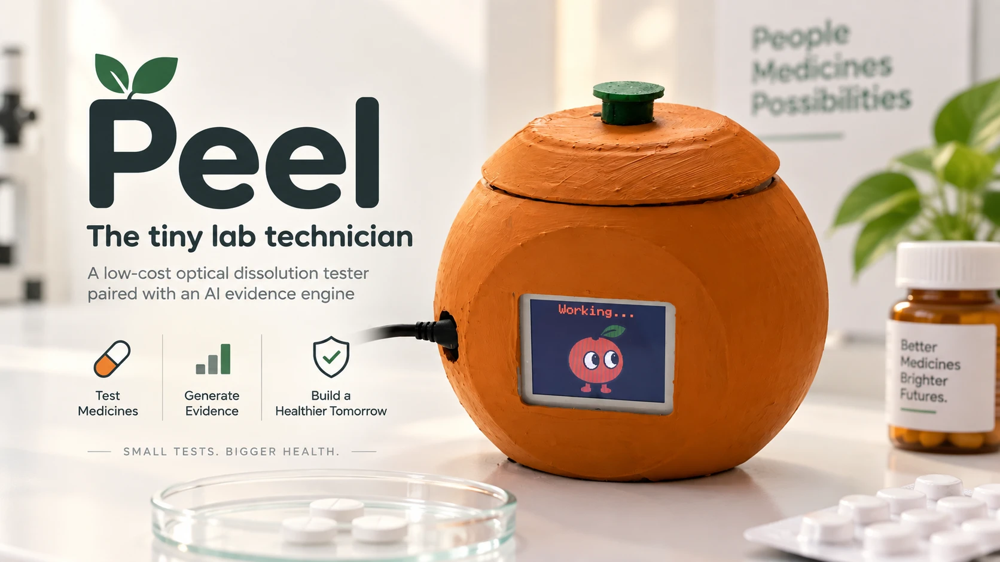
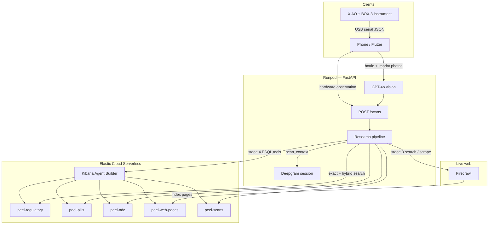

<p align="center">
  
</p>

# Peel

## Check the bottle, the imprint, and the pill — then read the evidence.

Peel is an open-source medicine check for places where a tablet and its packaging may not match. Photograph the **bottle**, read the **imprint**, measure the **pill**. The backend turns those three observations into a sourced report against a regulatory corpus, live web evidence, and (when present) a hardware reading.

[](https://github.com/viktorinkov/HackMIT-2026/actions/workflows/hardware.yml)
[](https://www.python.org/downloads/)
[](https://fastapi.tiangolo.com)
[](https://flutter.dev)
[](https://www.elastic.co)
[](LICENSE)

<p align="center">
  
</p>

<p align="center">
  <a href="https://youtu.be/Yiu2wGKJ6AM">
    
  </a>
  <br>
  <em><a href="https://youtu.be/Yiu2wGKJ6AM">Watch the Peel app demo</a></em>
</p>

## Table of contents

- [Why Peel exists](#why-peel-exists)
- [Architecture](#architecture)
- [Backend](#backend)
- [Getting started](#getting-started)
- [HTTP API](#http-api)
- [Peel Voice Agent](#peel-voice-agent)
- [Project layout](#project-layout)
- [License](#license)

## Why Peel exists

People often cannot tell whether the tablet in their hand is the medicine on the label. Packaging can be copied. Imprints can be faked. The contents are the part you cannot see.

Peel keeps three observations separate, then looks them up:

| Observation | Source |
| --- | --- |
| **Bottle** | GPT-4o vision reads a photo of the container (name, strength, NDC, lot, manufacturer). |
| **Imprint** | GPT-4o vision reads a photo of the tablet (characters, color, shape). |
| **Pill** | A phone-attached instrument records optical sensor data; `POST /scans` carries the actual readings to research and voice. |

The rest of this README is the system that sits behind those three inputs.

## Architecture



A check is one **scan** document in Elasticsearch. The phone (or curl) posts bottle, imprint, and hardware observations to `POST /scans`. That returns `202` immediately with `status: pending`. A background asyncio task then researches the scan and writes back to the same document. The client polls `GET /scans/{id}`.

```
pending  →  partial  →  complete
              ↑             ↑
         ~0.3–3 s        ~25–60 s
      exact lookups    agent + coerce
```

| Status | Meaning |
| --- | --- |
| `pending` | Scan exists; research is still starting. |
| `partial` | Deterministic Elasticsearch lookups are done. The report is already renderable. |
| `complete` | Live web + Agent Builder + structured coerce finished (or were skipped). |
| `error` | Elasticsearch was down when the scan was loaded. Later stages record `skipped` / `unavailable` and keep going. |

`revision` increments on every write, including stage timings and status patches.

### Research pipeline

`research/pipeline.py` runs six stages, each in its own timeout / try-except:

| Stage | What it does | Talks to |
| --- | --- | --- |
| 0 Load | Read the scan from `peel-scans`. Requires Elasticsearch. | Elasticsearch |
| 1 Normalize | Join keys: RxNav approximate-term, NDC shape, imprint tokens. Best-effort. | RxNav |
| 2 Deterministic | Exact lot / NDC / imprint-ladder / regulatory search. Writes a full report. Status → `partial`. | Elasticsearch |
| 3 Web | Build a tiny query set, search + scrape, index hits into `peel-web-pages`. | Firecrawl → Elasticsearch |
| 4 Agent | Elastic Agent Builder `converse()` with eight ES\|QL tools over the same indices. | Kibana → Elasticsearch |
| 5 Coerce | OpenAI structured output folds agent text + evidence pack into `ResearchReport`. | OpenAI |

If Firecrawl, Agent Builder, or OpenAI is missing or errors, the stage records `skipped` / `unavailable` and the stage-2 report stands.

Field-level contracts, mappings, and retrieval math live in [`backend/README.md`](backend/README.md).

## Backend

The backend is a FastAPI app (`backend/src/backend`) that owns vision, the scan store, retrieval, the research agent, concern reports, and the Deepgram handoff. Elasticsearch is the database.

### Runpod

The API is meant to run as a long-lived process on [Runpod](https://www.runpod.io/). [`backend/scripts/runpod-start.sh`](backend/scripts/runpod-start.sh) is the container entrypoint:

1. Installs [uv](https://docs.astral.sh/uv/) under `/workspace` when missing.
2. `uv sync --locked --no-dev --python 3.13`.
3. `uvicorn backend.app:app --host 0.0.0.0 --port 8000`.

Locally the same app is `uv run backend` (reload on `127.0.0.1:8000`). Secrets come from a repo-root `.env`, then `backend/.env` (later wins). On boot, `app.py` calls `ensure_indices()` so the five strict Elasticsearch mappings exist before the first `POST /scans`. If the cluster is unreachable at startup, the process logs a warning and later requests return 503.

The physical instrument (Seeed XIAO ESP32-S3 + ESP32-S3-BOX-3 display) streams JSON over USB to `mobile`. The app sends timestamped optical readings with the scan. Research and voice receive bounded samples and channel statistics, separately from drug identity. The old mock `POST /pill` endpoint has been removed.

### Elasticsearch

Everything Peel remembers lives on one Elastic Cloud Serverless “VectorDB” project (Elastic 9.6). Vector search goes through `semantic_text` fields backed by Elastic Inference (`.jina-embeddings-v5-text-small`).

Mappings are `dynamic: "strict"`. An unmapped field is rejected at index time, so `knowledge/fields.py` is the single source of truth for names across seed adapters, search, and Agent Builder tools.

Five indices:

| Index | Role | Search |
| --- | --- | --- |
| `peel-regulatory` | Recalls and alerts: FDA, WHO, Health Canada, MHRA, NAFDAC. | Yes — `body_semantic` (title + reason + a short product slice). Lot numbers stay on keyword fields. |
| `peel-pills` | NLM Pillbox imprint archive (~84k, frozen Jan 2021). | Keyword lookups |
| `peel-ndc` | openFDA NDC directory (~138k). Brand, generic, labeler, listing status. | Keyword lookups |
| `peel-web-pages` | Pages Firecrawl (or the agent) fetched. Grows on every live scan. | Yes — `page_semantic`. |
| `peel-scans` | One document per check: bottle, imprint, hardware, report, evidence, stage timings. | Keyword / stored |

Two retrieval modes:

- **Exact lookups** (`recalls_by_lot`, `recalls_by_ndc`, `ndc_directory`, the pill ladder) are `constant_score` term queries. They keep raw scores and are unioned with hybrid hits, so an old exact lot match still appears.
- **Hybrid + recency decay** (`search_regulatory`, `search_web`) is an Elasticsearch `linear` retriever. BM25 (weight 1.0) and semantic (weight 1.2) each get a Gaussian decay, then minmax-normalized and summed. The **filter is pushed into every leg**, so the vector search runs on an already-narrowed candidate set.

Decay floors: a regulatory record's score floor is 35% (30-day offset, 730-day half-life). A web page uses a 7-day half-life and a 0.20 floor. `recency_date` on a web page is `published_at` or `last_changed_at`. Re-fetching unchanged HTML leaves that date in place.

Lot strings collide (same code, different manufacturer; extraction junk like `"MG30"`). After a lot term hit, the backend corroborates against NDC and drug name. Only `exact_lot` / `all_lots_product` can become verdict `recall_match`. A lot that matches a *different* product, or an NDC that only appears because openFDA listed every sibling strength, stays a caution.

Imprint identification is a ladder: exact imprint first, then shape family as a hard filter, then shape as a boost, then fuzzy text. Color and size re-rank among documents that already matched an imprint tier.

### Elastic Agent Builder

Stage 4 is a Kibana Agent Builder agent (`peel-research-agent`) with eight ES\|QL tools compiled against the real mappings:

| Tool | Does |
| --- | --- |
| `peel.recalls_by_lot` | Exact batch match. |
| `peel.recalls_by_ndc` | Product-line recall lookup by 9-digit NDC. |
| `peel.regulatory_search_text` | Keyword search with metadata filters + recency. |
| `peel.regulatory_search_semantic` | Unfiltered vector search, score floor 0.70. |
| `peel.pill_lookup` | Imprint as-read against `peel-pills`. |
| `peel.ndc_lookup` | Registered identity for an NDC. |
| `peel.web_evidence_search` | Already-fetched pages, 7-day decay. |
| `peel.prior_scans` | Counts of earlier Peel scans for the same lot/NDC. |

The agent is registered on the first research request. `POST /scans` can succeed while Kibana is down. Specs are hashed onto the agent; `converse()` re-registers if another process overwrote them.

The evidence pack from stages 2–3 is passed in as already-executed tool results. Follow-up tools run for remaining gaps. On a conclusive lot hit that is one LLM call and ~25 s; ambiguous scans still take 40–60 s if follow-up tools run. The agent’s prose is an intermediate. Stage 5 (`gpt-4o` structured output) is what the client stores as `research`.

Kibana URL, if unset, is derived from `ELASTICSEARCH_URL` by replacing `.es.` with `.kb.`.

### Firecrawl

Stage 3 is the only place the backend spends Firecrawl credits. `peel-seed` fetches regulator bulk files and HTML over anonymous HTTP.

Per scan, at the defaults:

| Limit | Default |
| --- | --- |
| Searches | 2 |
| Pages scraped per search | 3 |
| Credits per search | `2 + pages` |
| Per-scan cap | 10  (`2 × (2 + 3)`) |
| Process-wide daily cap | 150 |

Queries are planned against that budget *before* anything is called. Planned searches run concurrently (`asyncio.gather`) inside a 75 s stage timeout. Social/video/forum domains are excluded (`-site:` plus a post-fetch drop).

Every fetched page is upserted into `peel-web-pages` by URL hash. Next time the same query is still inside its TTL (regulator 24 h, news 6 h, reference 7 d, other 48 h) and already has ≥2 pages, the scan spends **0 credits** and just appends its `scan_id`. The corpus gets smarter the more it is used.

There is an optional Kibana Firecrawl connector (`AGENT_BUILDER_FIRECRAWL_CONNECTOR_ID`) that lets the *agent* fetch pages itself, uncapped. Pages it pulls are still harvested back into `peel-web-pages`. Treat that flag as demo-only.

### OpenAI, Deepgram, reports

- **Vision** — `POST /photo-identification/bottle` and `/imprint` send the image to GPT-4o with prompts that extract structured fields and drop personal identifiers. The scan stores a SHA-256 fingerprint in `photos[]`.
- **Coerce** — stage 5 is `responses.parse` into `ResearchReport`. Citations are rebuilt from the evidence pack; the model may pick which stored id to cite.
- **Deepgram** — `POST /deepgram/session` mints Voice Agent settings from a `partial`/`complete` scan. The agent receives `scan_context` as a string (ElevenLabs-style dynamic variable).
- **Reports** — `POST /scans/{id}/reports` stores purchase date, place, and seller. The voice agent can draft; only the app’s Submit button writes.

### Seed corpus

```bash
uv run peel-seed seed --sources all
```

| Source | Index | Rough size |
| --- | --- | --- |
| openFDA enforcement | `peel-regulatory` | ~18k |
| Health Canada | `peel-regulatory` | ~4k |
| MHRA | `peel-regulatory` | ~600 |
| NAFDAC | `peel-regulatory` | ~400 |
| WHO alerts | `peel-regulatory` | ~80 |
| NLM Pillbox | `peel-pills` | ~84k |
| openFDA NDC | `peel-ndc` | ~138k |

~3 minutes once raw files are cached in `backend/data/` (gitignored). Idempotent: deterministic `_id`s overwrite. Anonymous HTTP only.

## Getting started

**Prerequisites:** Python 3.13, [uv](https://docs.astral.sh/uv/), OpenAI key, Elastic Cloud endpoint + API key. Optional: Firecrawl, Deepgram.

```bash
git clone https://github.com/viktorinkov/HackMIT-2026.git
cd HackMIT-2026/backend
uv sync
cp .env.example .env
```

```bash
OPENAI_API_KEY=sk-...
ELASTICSEARCH_URL=https://....es....elastic.cloud
ELASTICSEARCH_API_KEY=...
FIRECRAWL_API_KEY=     # blank skips live web
DEEPGRAM_API_KEY=      # blank skips voice session minting
```

```bash
uv run peel-seed seed --sources all
uv run backend                 # http://127.0.0.1:8000  — OpenAPI at /docs
```

Hardware firmware, debug app, and simulator: [`hardware/README.md`](hardware/README.md).

```bash
cd backend
uv run pytest
uv run python scripts/smoke.py          # read-only against the seeded cluster
uv run python scripts/smoke.py --e2e    # one full scan (Firecrawl + OpenAI)
```

## HTTP API

Interactive docs: [http://127.0.0.1:8000/docs](http://127.0.0.1:8000/docs).

| Method | Path | Role in the architecture |
| --- | --- | --- |
| `POST` | `/photo-identification/bottle` | Vision → bottle observation |
| `POST` | `/photo-identification/imprint` | Vision → imprint observation |
| `POST` | `/scans` | Create scan, start pipeline (`202`) |
| `GET` | `/scans/{id}` | Poll envelope (`pending` / `partial` / `complete`) |
| `GET` | `/scans/{id}/context` | `scan_context` for the voice agent (`?as_string=true`) |
| `POST` | `/scans/{id}/research` | Re-run pipeline (`{"force": true}` cancels in-flight) |
| `GET` | `/scans?device_id=` | History by device, lot, or NDC |
| `POST` | `/scans/{id}/reports` | Concern report |
| `POST` | `/deepgram/session` | Mint Deepgram settings from a ready scan |
| `GET` | `/knowledge/lot/{lot}` | Direct lot lookup |
| `GET` | `/knowledge/ndc/{ndc}` | NDC directory + related recalls |
| `GET` | `/knowledge/pill` | Imprint ladder |
| `GET` | `/knowledge/search` | Hybrid regulatory or web search |
| `GET` | `/knowledge/stats` | Index counts |
| `GET` | `/health` | Liveness |

## Peel Voice Agent

After Results, **Talk to Peel** opens a Deepgram Voice Agent session for that scan. One WebSocket runs STT, the LLM, and TTS. The app never ships the API key: `POST /deepgram/session` mints a temporary token. You can interrupt the greeting; keyterms come from this scan; the latency chip is Deepgram’s `total_latency`; Flux TTS falls back to Aura-2 if needed. A HIPAA BAA is Enterprise-only.

The longer judge-facing write-up is [`docs/deepgram/WHY-DEEPGRAM.md`](docs/deepgram/WHY-DEEPGRAM.md).

## Project layout

```
HackMIT-2026/
├── backend/                 FastAPI app on Runpod
│   ├── src/backend/         vision, scans, research, knowledge, reports, Deepgram
│   ├── scripts/             smoke tests, runpod-start.sh
│   └── README.md            mappings, retrieval, Agent Builder, Firecrawl budget
├── hardware/                XIAO firmware, BOX-3 face, debug Flutter app, simulator
├── assets/                  README images and media placeholders
├── photos-for-testing/      sample bottle and imprint photos
└── LICENSE
```

## License

MIT. See [LICENSE](LICENSE).

Seeded records keep their upstream licences (openFDA/CC0, WHO CC BY-NC-SA 3.0 IGO, Health Canada and MHRA Open Government Licence, NAFDAC summarise-and-link, Pillbox/RxNav US public domain). Those terms travel with the indexed documents.
